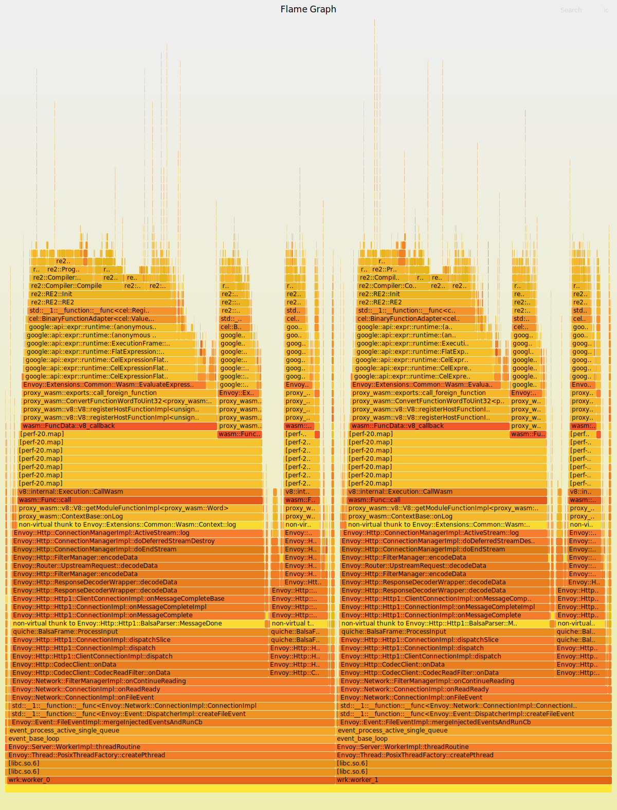
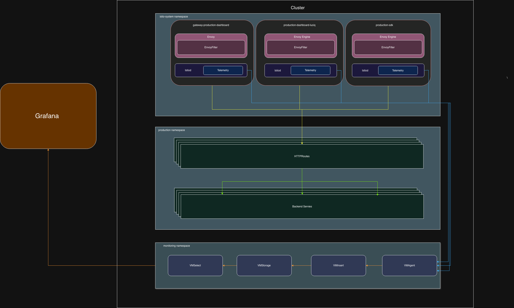

# Why to use EnvoyFilter instead of WasmPlugin in Istio Gateway for Path Normalization
### TL;DR:
- The Goal: Migrate our routing from Nginx to Istio Gateway and migrate our Grafana dashboards, using a tool to normalize paths and avoid high cardinality metrics.

- The Problem: WasmPlugin burned our CPU (2–3 cores per pod on just 5% of traffic) because it did sequential checks on matched regexes.

- The Solution: We switched to EnvoyFilter (with Lua), which was much, much more performant.

- The Catch: Compiling everything into one shared Istio Gateway created a huge combined EnvoyFilter file. This led to alphabetical regex collisions between services, making us rethink our gateway design entirely.

## The Migration and the Cardinality Problem
After the retirement of Nginx, the second recommended choice for routing was Istio, and after some architecture decisions, we chose to go with Istio Gateway with routing HTTPRoute resources.

After the migration, we reached a state where we needed to also migrate our Grafana dashboards to the new setup. Since we needed a tool for normalizing the paths to avoid high cardinality in the metrics, we began our journey with WasmPlugin. It was the most known tool and heavily recommended in the community for exactly this case.

## What is the Problem with WasmPlugin?
When we tested the setup in our development environment, everything seemed seamless. The problem began with high load of traffic a.k.a after applying the setup in production.

At first, we distributed the traffic between Nginx and our new Istio gateways: 5% for Istio and 95% for Nginx. This is where the issue started. We found that Istio was consuming a huge amount of CPU compared to the percentage of traffic it received. We did an analysis and found that WasmPlugin was burning the CPU and taking a lot of resources for normalizing the paths, which was done by sequential checks on matched regexes.

Taking it by numbers: for just 5% of our traffic in Istio, it took a total of 10 pods, with each pod burning between 2 to 3 cores. That was a lot compared to how Nginx used to consume.

## One Other Chance for WasmPlugin: Load Testing and Grouping
The first thing that came to my mind was optimizing the plugin. Instead of making it run sequentially, we could group similar paths, check only the group header, and terminate once matched, so the time complexity would be O(log(M+N)) rather than O(N), where the N is the number of paths and M is number of group headers. We built a reusable k6 load-testing harness to drive traffic up to 50k RPS (Requests Per Second) and capture performance flamegraphs.

We ran two major test iterations:

**Run 1: The Sequential Baseline (Without Grouping)**
Under a 50k RPS spike, the public gateway maxed out 10 pods, burning about 1.5 to 2 cores *per pod*. Collectively, it was burning ~17 cores just to execute the Wasm filter sequentially.

**Run 2: Grouping Paths & Internal Checks**
We modified the plugin to group the paths and moved the regex checks internally. The throughput improvements were massive. This allowed us to handle our heavy 10k RPS plateau using fewer pods, and pushed our throughput significantly higher. 

Here is the full picture of how throughput improved across the iterations:

| Service | Sequential (Without Grouping) | Grouping & Internal Checks |
|---|---|---|
| **Service 1** | 28.8k RPM | 59.7k RPM |
| **Service 2** | 57.7k RPM | 97.0k RPM |

At first, this sounded like a massive win. Our analysis showed real, tangible optimizations. But unfortunately, while the RPM was much higher, hitting that absolute peak of 50k RPS still saturated all 10 pods at ~2 cores each. 

Even with our best optimizations, WasmPlugin was simply too heavy for our infrastructure during traffic spikes. We wanted to find other solutions.

## Asking the Community
My manager said, "If you see yourself walking alone and facing issues that no one else is facing, then it's more probably you are on the wrong road." So we posted questions in the Istio Slack community, defined our problem, and they suggested we could use either EnvoyFilter or Wasmtime, which are more performant than WasmPlugin.

Starting from the Beginning: EnvoyFilter
The transition from Wasm to EnvoyFilter surprised me so much. The performance was much, much, much better than expected, and it solved a lot of our issues.

## Starting from the Beginning: EnvoyFilter
The transition from Wasm to EnvoyFilter surprised me so much. The performance was much, much, much better than expected.

We ran the exact same 50k RPS k6 load test against the new EnvoyFilter setup. It was almost hard to believe:

* During the absolute peak spike the same one that forced WasmPlugin to burn ~17 cores across 10 pods the EnvoyFilter setup barely reach 6 cores.
* CPU usage hovered between `300m` to `600m` (0.3 to 0.6 cores) per pod.

## Current Design & New Problems
While the performance was great, the setup introduced new headaches. Here is how our design works:

- Istio uses gateways.

- For each gateway, there is 1 EnvoyFilter.

- For each gateway, there is more than 1 service.

- Each service has its own EnvoyFilter.

After compiling and applying this in the cluster, all the EnvoyFilters for each service are combined together to form one huge file of EnvoyFilter that processes the services one by one. If they all have the same priority (the default is 0), they simply get organized alphabetically.

After testing the EnvoyFilter in dev, we applied it in production and hit three distinct problems:

1. Lua Language Limitations
First, the Lua language does not support the heavy regex that we used in production. We had to customize, filter, remove, and reshape the EnvoyFilter Lua script to transform our regex into something that Lua understands and works with.

2. The Alphabetical Regex Collision
Second, because we use Istio as a shared gateway, the regexes for all our services got combined into that one huge Lua file. We observed that some services (let's call one Service A) were alphabetically ordered before others (Service C). Service A had regex rules that were more generic. By default, the requests meant for Service C got matched with the general, least specific rules of Service A, simply because A came first in the alphabet.

The solution for this was either:

- Option A: Fix the general rules of the least specific paths in Service A (which requires more work from different teams).

- Option B: Raise the priority of the services that have the generic rules. Any number above 0 has less priority according to the documentation, so we could force specific services to be processed first.

3. The Gateway Design Itself
Third, the problem we faced wasn't actually related to Wasm or EnvoyFilter; it was because of the gateway design we implemented in the first place. Because the gateway is like one huge building block that serves all our services, if it fails, then all our services fail.

(Insert your architecture diagram here showing the Gateway and EnvoyFilter compilation flow)

## What This Teaches
Because of that final realization, we agreed on shifting to an Istio Service Mesh instead of relying purely on a Gateway.

Here are the action items and lessons we are taking away to solve these issues in the long term:

- Switch to service mesh instead of gateway, Moving away from a monolithic gateway removes the single point of failure and stops all our filters from compiling into one massive file.
- Don't walk alone, Search and ask what others are doing better.
- Talking about the problem was in my case the first step to solve it. Asking for help is the most valuable thing I learned here, so a huge thanks to my team.