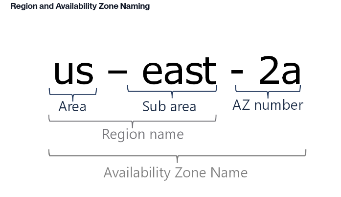

# AWS 2-01 Architect Fundamentals

- AWS region is a physical geographic location with 2 or more Availability Zones.
- en Availability Zones in turn consist of 1 or more Data Centers.
- the AWS PoP (points of presence) network sits at the edge of the network to reduce latency.
- Multiple Availability Zones (AZs): AWS regions are divided into isolated Availability Zones, which are separate data centers. By distributing resources across multiple AZs, applications can continue running even if one AZ fails.
- Load Balancing: AWS Elastic Load Balancers distribute traffic across healthy instances in multiple AZs, ensuring continued availability during failures or traffic spikes.
- Auto Scaling: AWS Auto Scaling automatically adjusts the number of instances based on demand, maintaining performance and availability.
- Fault Tolerance: Services like Amazon S3, RDS, and DynamoDB are designed with built-in fault tolerance, ensuring data availability and reliability.
- naming 

- Edge locations in AWS are data centers located globally that serve as endpoints for AWS services, primarily for content delivery and caching. They are part of Amazon **CloudFront**.
    - Content Delivery: Edge locations cache copies of static and dynamic content, such as web pages, videos, and images, to reduce load times for users.
    - Reduced Latency: By serving content from the nearest edge location to a user's geographical location, the time it takes for data to travel is minimized, improving performance.
    - Global Reach: AWS has many edge locations worldwide, allowing applications to deliver content quickly to users in different regions.

## Six Pillars of the AWS Well Architected framework
- Operational Excellence
    - Manage and automate changes
    - Respond to events
    - Respond to change
    -  it’s important to consider how it will be deployed, updated, and managed. Implement engineering practices that focus on reducing defects and enabling quick, safe fixes.
- Security
    -  ability to protect information, systems, and assets while delivering business value by conducting risk assessments and implementing mitigation strategies.

- Reliability
    - Recover from infrastructure or service failures
    - Dynamically acquire computing resources to meet demand
    - Mitigate disruptions
    - emphasizes high availability, fault tolerance, and overall redundancy.
- Performance Efficiency
    - Choose and maintain efficient resources.
    - Democratize advanced technologies
    - Employ mechanical sympathy
    - Maintain that efficiency as demand changes and technologies evolve.
- Cost Optimization
    - Measure efficiency
    - Adopt the right consumption model
    - Eliminate un-needed costs
    - Consider using managed services
- Sustainability
    - Establish sustainability goals.
    - Choose efficient hardware and software
    - Maximize utilization
    - Reduce downstream impact
