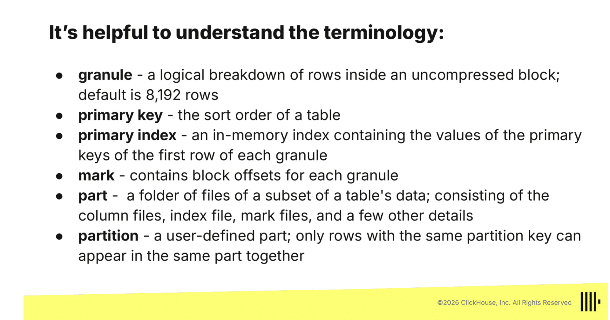

# ClickHouse Admin Workshop

## Material

[clickhouse admin workshop course](https://learn.clickhouse.com/files/4367144/SCORM_980003938/scormdriver/indexAPI.html)

## 1.1: Introduction to ClickHouse

- clickhouse is a SQL DB
- it's just a binary file that has 2 main commands `./clickhouse server`, `./clickhouse client`.
  - server > starts the clickhouse server itself
  - client > starts the interactive shell with the server
- it has bunch of defaults tables, one for settings and can override the settings with creating a new `config.xml` file and `config.d` folder and that new configs instantly got loaded to clickhouse server and doesn't need to restart the server

## 2.1: ClickHouse Architecture

- CH logically group tables into databases
- database in CH is basically a folder
- `MergeTree` engine is used for high load tasks, the most widely used one is `ReplicatedMergeTree` which is used in CH Clusters that have more than 1 instance
- each table has an **engine** > each engine determine how and where the data is stored
- the `PRIMARY_KEY` = `ORDER BY ()` since the clickhouse doesn't consider uniqueness for PK, then it actually isn't unique at all
  - the benefit of using it just to determine HOW ACTUALLY the data stored in disk
  - reference > [How are ClickHouse Primary keys different?](https://clickhouse.com/docs/migrations/postgresql/data-modeling-techniques#how-are-clickhouse-primary-keys-different)
    > read that article again
- INSERTING Data > insert should be performed in a **Bulk** or use the async insert feature
  - why? because each insert creates a part which is sorted in a separate folder in the disk,
    - what is part? part is a collection of data that is has been created using the `insert` command
      - each column in the part folder has a immutable file with just the column data
    - _Wide vs Compact_
    - Compact > if your data doesn't meet the smallest number of rows and bytes, CH stores it in one file
    - Wide > if your data is big enough, CH stores each column in a separate file
      - mainly they are a table settings that can be customized using this command
        ```sql
        CREATE TABLE my_db.events_by_month
        (
            device_id UInt32,
            event_type String,
            value UInt64,
            timestamp DateTime
        )
        ENGINE = MergeTree
        PRIMARY KEY (device_id, event_type)
        PARTITION BY toYYYYMM(timestamp)
        SETTINGS min_rows_for_wide_part = 0, min_bytes_for_wide_part = 0;
        ```
  - parts are created by each insert and if we have an insert every 1s then this is a 60 parts in 1min which is insane so to solve this huge amount of parts they got merged in the background and merged into **merged_parts**
  - and by time the merged_parts are merged to gather into bigger merged parts
    - `max_byte_to_merge_at_max_space_in_pool` this config is by default = 150 and responsible by the max amount of data to be merged_parts
- Searching uses the Primary Index which is Sparse
  - what does that mean??? it means that each part/merged_part is basically a folder that has bunch of data, it could be around 1million rows of data so how can i search so quickly in these rows ?? by primary index + granular
    - what are granular? it's a 8193 block of rows that are parsed sequentially to get the data by sorting the data based on the primary index
      - sparse = binary search, value to search about is the primary index, block of code to jump through = granular
      - **granular** > is the smallest indivisible data set that clickhouse reads when searching rows
  - so by now we have all this which is done the searching thing but wait the part folder doesn't save the data as it is it save 2 types of data, the primary key/order by attributes stored in compressed files and the reset of data are in uncompressed files so how the granule now which uncompressed file to go to ??
    - by using the mark > it's a file with the same uuid with primary key which stores the offset of each uncompressed data of granular



## 4.1: Scaling ClickHouse
- Sharding > db table can be split into smaller tables, so one table is one shard by default 
- Replication > redundancy, each table/shard consist of one or more replicas placed in different servers 
- based on what to choose your server?
  - cpu > improve data ingestion speed
  - disk > query performance 
  - memory > improve data with high cardinality 
- to enable replication for CH cluster it must add Keepers 
- for further reading this article is good from their official docs [sclaing](https://clickhouse.com/docs/architecture/horizontal-scaling)