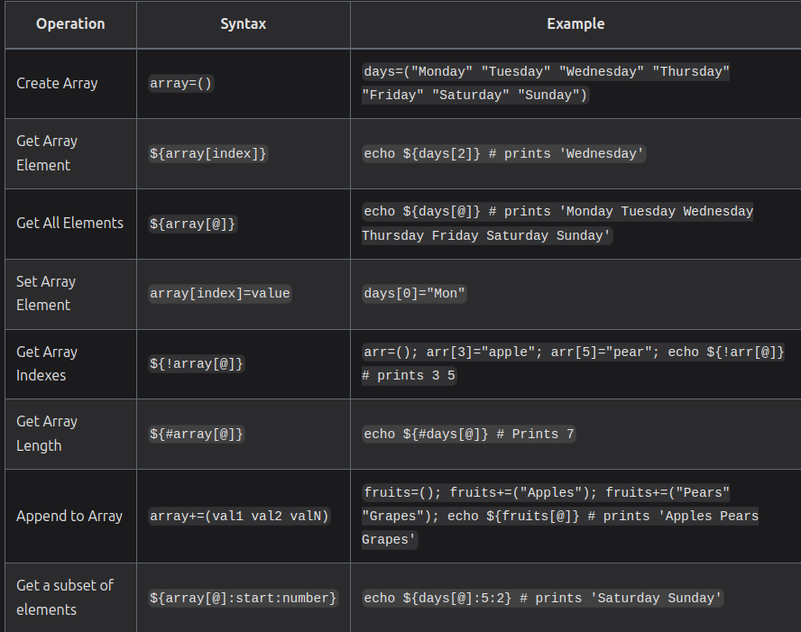

# Shell Script Essentials 

- comments are better to describe why rather than what/how

- running shell by `sh` or `bash` doesn't required having `#!/usr/bash/sh` in the first line

- **shebangs**: `#!`is a special set of symbol at the beginning of a file that tells the system what program should be used to run the file.
    - after the shebang write the full path tp the program which should be used to open/execute the file.


- create multiple lines in command using `\` 
```sh
tail ~.bash_history -n 1000 \
    | sort \
    | uniq -c \
    | sed 's/^ *//' \
    | sort -n -r \
    | head -n 10
```
    - tail -> gets the last 1000 lines from bash_history
    - sort -> put all of the duplicates next to each other
    - uniq -c -> remove all duplicates and `-c` count the duplicates 
    - sed -> remove thw leading spaces from the output 
    - sort -> sort list in numerically and in reverse order
    - head -> gets the first 10 lines 


- `env` command can search through `$PATH` to find the path os the command to execute 

- the safest and most portable way to specify how a shell script should run is by running by `env`
```sh
#!/usr/bin/env python3
print("hello scripting world!")
```
    - change executable permission `+x`
    - run by `./script_name` 


- when we run a shell script, a new shell is created as a child process of the current shell, this means that if change made in the environment, such as variable it will NOT affect the environment of the shell that ran the script.

- if we want to run the commands in the file in the context of the current shell we can use the `source` command to load the file 

- `source` let the commands in the file script run in the current shell
- `. ~/script` = `source ~/script`
- `ln -s ~/script_path /usr/local/bin/script_name` this creates a link/shortcut for desire script file with script name in usr/local/bin folder


## Variables, Reading Input, and Mathematics 
- shell vars: the variable we crete in the shell, they are accessible in the current shell session that we are running 
- shell vars are isolated to the current process, they are used by local session only 
- `export` tells the shell to expert the var to all child process as environment variable 

- to execute a set of commands in a *sub shell*, we can use `$()` sequence. everything inside the brackets will be executed in a new shell and we can store the output of command in a var by using *=*
```sh
password="helloAndGoodbye"
masked_password=$( echo "$password" | sed 's/./*/g')
echo "setting password '$masked_password'"
``` 

- combine env vars with strings using `{}` around env var
```sh
backupdir="${USER}_backup"
echo "Creating backup folder at: '${backupdir}'"
mkdir "${backupdir}"
```

- arrays in bash 


- Associative Arrays aka dictionaries 
```sh
declare -A book # declare a associative array called book
book[title]="Effective Shell"
book[author]="Dave Kerr"

echo "Book details: ${book[title]} - ${book[author]}"
```

- single quotes - literal values -> should be used when you want to put special characters into a variable or call a command that includes whitespace or special characters
```sh
message='   ~~ Save $$$ on with ** "this deal" ** ! ~~   '
echo "$message"
```


- single quote - ANSI C -> allow you to use special characters from c language 
```sh
message1='Hello\nWorld'
message2=$'Hello\nWorld'
echo "Message 1: $message1"
echo "Message 2: $message2"
```


- double quote - parameter expansion -> it allow to use backslash to print special characters
```sh
deal="Buy one get one free"
message="Deal is '$deal' - save \$"
echo "$message"

# output
# Deal is 'Buy one get one free' - save $
```
    - *`* backtrack is used to run in sup shells, it's better to use `$()` convention
    ```sh
    $ echo "The date is `date`" # not good
    The date is Sun 23 May 2021 11:36:54 AM +08 

    $ echo "The date is $(date)" # better
    The date is Sun 23 May 2021 11:36:54 AM +08
    ```

- Shell Parameter Expansion
    - length: `${#var}`
    - set default value: `username=${var:-$USER}`
    - substring: `${var:start:count}` ex. `path="~/effective-shell" echo " {path:0:2}"`
    - make upper case `${var^^}`
    - make lower case `${var,,}`
    - variable indirection `${!var_name}`: get the value of a variable but don't know the name of the variable

- Read from shell
    - default: `read` command and by default answer stores in `$REPLY`
    - into a variable: `read var_name` 
    - using prompt: `read -f "prompt" var_name`
    - secrets: `read -s -p "prompt" var_name` 
    - limiting the input: `read -n 1 -p "prompt" var_name`

- 