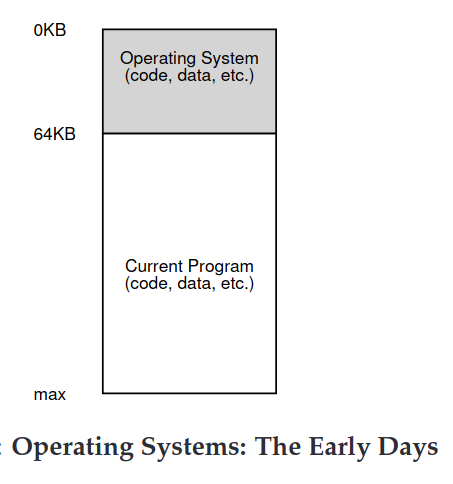

# The Abstraction: Address Spaces 

## Early Systems 
- the os set a routines in memory and 1 running program in physical memory and used the rest of memory.

## Address Space 
- **address space**: is the running program's view of memory in the system.
- each address space contains all of the memory state of the running program 
- *code*, *stack* and *heap*: parts of address space
- *code*: where the code of the program lives 
- *stack*: keep track of where it is in the function call chain as well as to allocate local variables and pass parameters and return values to and from routines
- *heap*: used for dynamically allocated user manages memory
- the program really isn't in memory at physical address 0 for example rather it is loaded at some arbitrary physical address this is called **Virtualizing Memory**
- **VM Goals**: 
    - *Transparency*: the program shouldn't be aware of the fact that memory is virtualized, the program behaves as if it has its own private physical memory 
    - *Efficiency*: in terms of times and space 
    - *Protection*: protect processes from one another as well as OS itself
    - *Isolation*: each process should be running in its own isolated space 
- any address that is print in a program is a virtual address too