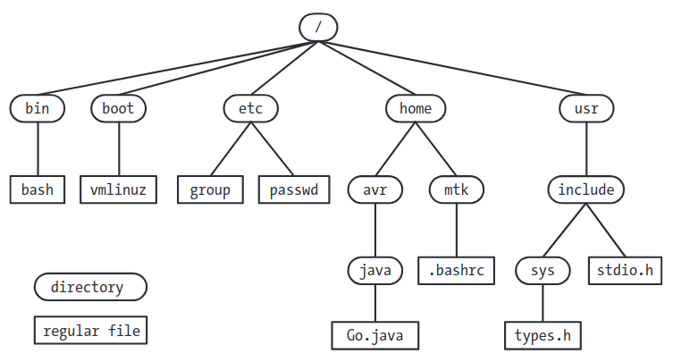

# Fundamental Concepts

## 2.1 The Kernal 
- can run programs without need for kernal; **kernal** provide a software layer to manage the limited resources of a computer.
- **kernal** tasks are: 
1. precess scheduling
2. memory management 
3. provision of a file system 
4. creation and termination of processes 
5. access to devices 
6. networking
7. provision of a system call apis

- kernal has 2 modes: 1.user mode 2.kernal mode aka privileged mode  -> user mode has limited operations to do and some has to request from the os to be in kernal mode to access all hardware operations

- all communication between processes is done via mechanism provided by the kernal 

## 2.2 The Shell
- **shell** is a special purpose program designed to read commands typed by a user and execute a programs  

## 2.3 User and Groups 
- **Users**: every user of the system has a unique login name and user id(UID), **groups** sharing a set of files to all members inside a group, **superuser** has all privileges within the system, has an id=0 and normally called *root*.

## 2.4 Hierarchy

- at the base is the *root aka /*  
- each file is marked with *type* which is the kind of file, there is several types and one of them is *regular/plain* which is the normal one.

- *directory* file contains a table of filenames coupled with references to the corresponding files, *link* is the combination of filename + reference.

- every directory has at least 2 entries: (.) which is the link to directory itself and (..) is the link to present directory.

- *symbolic links* are alternative name for a file, a file that contains the path to another file called target, if the path doesn't exit it said to be dangling link.

- *filenames* avoid starting filename with (-) and don't use (/) because it may has a special meaning in sell.

- *permissions* 9 bits represent the 3 permissions, read, write, and execute. each file/ directory has those 3 permission.

## 2.5 I/O Model

- **universality of i/o** means that the same system calls are used to perform I/O on all types of files/devices.

- UNIX systems have no end to file character the end of file os detected by a read that returns no data.

- **file descriptor** is a integer that identify an open file within a process, used by os, this can be accessed via a *open()* system call that returns a file descriptor.

- 3 file descriptors: 0. standard input (stdin), 1. standard output (stdout), 2. standard error (stderr).

## 2.6 Programs 

- programs have 2 forms: 1. *source code* code written in any programming language, 2. *binary machine language* the text is covert to binary instructions that computers can understand.

- compiling: the process of step 1 to become step 2 

- *filter* is the name of program that is use stdin and stdout.

## 2.7 Processes

- **process**: is an instance of an executing programs, the kernal loads the code to virtual memory aka part of memory but has stats and end but is seam to process that is starts from 0 to limit, and then the kernal sets up a data structure that keeps to recode various infos about process.

- **process memory layout aks segments** divided into: 1. *text* the code, 2. *data* the static variables, 3. *heap* dynamically allocates extra memory, 4. *stack* local variables and functions call linkage info.

- *execve() system call aka exec()* load and execute a new program, destroys the existing process segments, replace with new one.

- (PID): process id.

- (PPID): the id of the process that requested the kernal to create a new process.

- process is terminated using 2 ways: 1. using *exit() system call* or by *signal*, anyway a process has a *termination status* -small number used by parent process in *wait() system call*- and the process itself changes its status if it used the exit system call, in using signals the termination status is set by the type of signal that caused the death of the process, 0 is succeeded and any other number is an error type.

- 