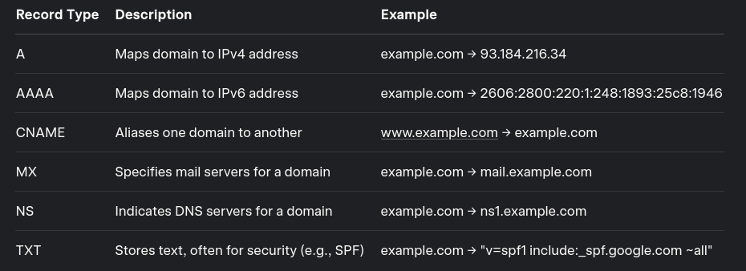

# KodeKloud - Linux foundation


## Working with Shells 
- viewing file sizes 
    - `du -sk <file_name>` shows the file size in kilo bytes 
    - `du -sh <file_name>` shows the size of file in human readable way in mega bytes 
    - `ls -lh <file_name>` same as `du -sh`
- searching
    - `locate <file_name>` shows all the file location that matches the giving file name, may not be useful for recent added files because it depends on mlocate db which is may take a time to update, to solve this problem run `updatedb` in root user to update db
    - `find <location> -name <filename>` 
    - `grep -r "word" <directory>` search through the files in directory for the word
    - `grep -v "word"` display all lines that doesn't match the word
    - `grep -w "word"` matches only the word 
    - `grep -A1 -B1 "word"` display the line before and after matching the world
- IO redirection
    - std error, std input, and std output can be redirected to a file
        - output: use `>` to append to new file, `>>` appends to existing file
        - error: use `2>`to forward the error messages to a new file, for redirect to existing file use `2>>`, to execute and not print/store any messages error use `2> /dev/null`

## Network
- DNS: 
    - mapping IPs to names via add record in `/etc/hosts` where `<server_ip_address> server_name` and this local dns is taken for granted, it doesn't check if the server ip has this actual name
    - name resolution is translating hostname to ip address, tools like `dig` and `nslookup` are useful for this case
    - dns server is a server that has all the mapping between ips and names and any other server is look up for that serve, it configured in `/etc/resolv.conf` which has the ip for dns server
    - if a name server exist in both `/etc/hosts` and dns server it first lookup for hosts file and then check for dns server if not exist, this order can be changed via `/etc/nsswitch.conf` field `hosts:  files dns` if switch between files and dns then the order switched too 
    - if a domain is not exist in my dns server or host file then i can add a `nameserver  8.8.8.8` in `/etc/resolv.conf` which will point to the dns server for google which host all public servers
    - 
- Switching & Routing
    - how 2 computers/servers connects to each other? by connecting to switch and it creates a network with interface on each host, `ip link` display the interfaces without ips, `ip addr` display with ips
    - `ip addr add <server_ips> dev <network_name>` this command creates interface for other device with specified server ip, this communication done only if all system in the same network
    - router connects 2 networks together
    - gateway is the door to the router, `route` display the kernal routing table, to configure route run `ip route add <network_ip> via <router_ip>`, this configurations should be done for each system to be able to access the other system
    - default router is the gateway for any network ip that doesn't exist in routing configurations 
    - all these changes are valid until the system restarted, for persist configurations add it to `/etc/network/interfaces`
    - `ip link set dev <network_name> up` this command rerun the network interface if it goes down 


## Security and File Permission
- linux accounts:
    - the information for each user is stored in `/etc/passwd`
    - the infos of group stored in /etc/group
    - each group has unique id called GID 
    - `id <username>` is displaying the userid, group id, groups user is part of 
    - root has userid = 0
    - types: user account, superuser, system accounts and service account
    - `who` display list of current users who logged in the system 
    - `last` display the record of all logged in users, shows date and time when the system was rebooted
    - `useradd <username>` adds user to the system should be run as root
    - `passwd <username>` sets password for username should be run as root
    - `userdel <username>` deletes user 
- file permissions: 
    - `-rwxr-xr-x` 
        - `-` file type
        - next 3 chars `rwx` permissions for owner
        - next 3 chars `r-x` permissions for group owning 
        - next 3 chars `r-x` permissions for other
    - meanings: 
        - `r`: means can read, octal value 4
        - `w`: means car write, octal value 2
        - `x`: means can execute, octal value 1
    - if the user is the owner, the owner permissions applied and other ignored 
    - if the user is not the owner but in a certain group the group permissions applied and other ignored
    - `chmod <permissions> <filename>` changes file permissions
        - `u+rwx` -> `u` for users and `+` for adding following permissions
        - `ug+r-x` -> `ug` for users and groups and adding the following permissions
        - `o-rwx` -> `o` for others 
        - `777` means full access for users, groups and others since 4+2+1 = 7
        - `555` means read and execute access for owners, groups and others since 4+1=5
        - `660` means read and write for owners and groups but nothing for others 
        - `750` means full access to owners, read/write to group and nothing to others 
    - `chown <owner:group> <filename>` changes permissions for users and optionally for groups


- Network security via iptables:
    - tables: iptables organizes rules into tables based on their purpose, most known is *filter* tables used to filter packets
    - chains: each table has chain, which lists of rules processed in order, *INPUT*, *OUTPUT*, & *FORWARD* chains 
    - rules: each rule defines what to do with a packet based on criteria such s source/destination ip, port, or protocol
    - actions: 
        - *ACCEPT*: allow all packet
        - *DROP*: silently discard the packet
        - *REJECT*: discard the packet and send error
        - *LOG*: log the packet details
    - default policy: each chain has a default action applied if no rule matches a packet
    - multiple options: 
        - `-A`: add rule in the bottom 
        - `-I`: add rule in the top
        - `-P`: protocol
        - `-s`: source
        - `-d`: destination
        - `--dport`: destination port
        - `-j`: action to take
        - `-D`: delete a rule by line number
    - the rule that comes first and matches the request is accepted and other is ignored 
    ```bash 
        # Step 1: Flush existing rules
        sudo iptables -F

        # Step 2: Set default policy to DROP
        sudo iptables -P INPUT DROP
        sudo iptables -P OUTPUT ACCEPT
        sudo iptables -P FORWARD DROP

        # Step 3: Allow localhost
        sudo iptables -A INPUT -i lo -j ACCEPT

        # Step 4: Allow established connections
        sudo iptables -A INPUT -m state --state ESTABLISHED,RELATED -j ACCEPT

        # Step 5: Allow HTTP, HTTPS, and SSH
        sudo iptables -A INPUT -p tcp --dport 80 -j ACCEPT
        sudo iptables -A INPUT -p tcp --dport 443 -j ACCEPT
        sudo iptables -A INPUT -p tcp --dport 22 -j ACCEPT

        # Step 6: Save rules
        sudo iptables-save > /etc/iptables/rules.v4
    ```
    - cronjobs: 
        - scheduled task managed by the cron daemon, a time based job schedular, it allows users to automate repetitive tasks by running scripts and commands at specified times.

        - each user has it's own crontab configuration file
        - `* * * * * /path_to_script`: this is the syntax
            - min, hour, day of month, month, day of week
        - `crontab -e`: edits the file
        - `crontab - l`: list current cronjobs
        - `crontab -r`: remove all cronjobs fro the user
        - `*/5 * * * * /script` ex. runs the script every 5 min
        - `*/30 * 15 * 1 /script` ex. every 30 minutes on the 15th day of any month, but only if that 15th day is a Monday.

- service managements 
    - service: background processes or daemons that provide specific functionality such as web servers, databases or system utilities such as ssh.
    - systemd: init system is the standard tool for managing these services 
    - lives in `/lib/systemd/system/` or `/etc/systemd/system/` or user modified
    - `systemctl`: is command line tool to manage services, util, and systemd itself 
    - `journalctl`: tool to view and analyze logs generated by systemd and services 
    - 
    ``` ini 
        [Unit]
        Description=Regular background program processing daemon
        Documentation=man:cron(8)
        After=docker.service # run after postgres service 

        [Service]
        EnvironmentFile=-/etc/default/cron
        ExecStart=/usr/sbin/cron -f -P $EXTRA_OPTS # command to execute 
        Restart=on-failure # rester the service in failure cases
        User=user
        RestartSec=10 # restart interval 10 seconds

        [Install]
        WantedBy=multi-user.target # load when booting into multi-user
    ```
    - `systemctl daemon-reload`: running this command after making changes to a services unit file, reload system manager configurations and make systemd aware of the changes, changes only affect after running this command, for avoiding this run make the changes via `systemctl edit project-file.service --full` this opens the file in text editor and apply changes safely