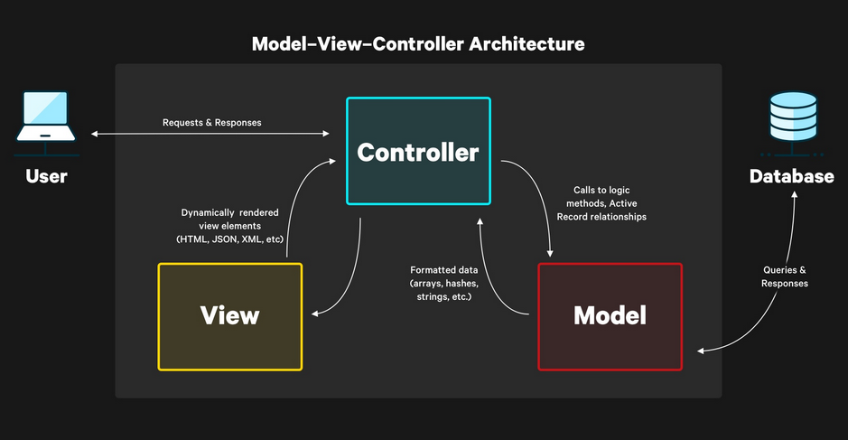

## Rails Basics

### Resources 
- [rails docs get started guide](https://guides.rubyonrails.org/getting_started.html)

### MCV and General Concepts

- Model - Manages the data in your application. Typically, your database tables.
- View - Handles rendering responses in different formats like HTML, JSON, XML, etc.
- Controller - Handles user interactions and the logic for each request.

- To get Rails saying "Hello", you need to create at minimum a route, a controller with an action, and a view

### Active Record Model
- what is maps relational database to ruby code.
- create a new model using commands: `rails generate model Product name:string`
- should migrate after creating a model `rails db:migrate`
- Model names are singular, because an instantiated model represents a single record in the database.
- Rails makes the database table names plural, because the database holds all the instances of each model.
- after initializing object using `new` method should save that object using `.save` method.
- 2 in 1 `create` method initializing and saving an object.
- `all` gets all objects for a model = ` SELECT "products".* FROM "products"`.
- `where` filters records that matches the attribute value.
- `order(attr: :asc)` sort records by name in ascending alphabetical order by attr.
- `.find(1)` finds record 1 
- use the `find` method to get the object and obtain `update(attr:val)` to update the attribute by the value 
- `.destroy` is deleting the object 
- presence validation to the Product model to ensure that all products must have a name. ex `validates :name, presence: true`

### Routes 
- all CRUD operations ha a shortcut `resources :<model_name>`
- create routes are in `config/routes` and specify the request type then the path, and to the <controller_name>#<method_name>
`get "/products", to: "products#index"`

### Controllers and Actions
- `rails generate controller Products index` creates controller called ProductsController and method called index
- 